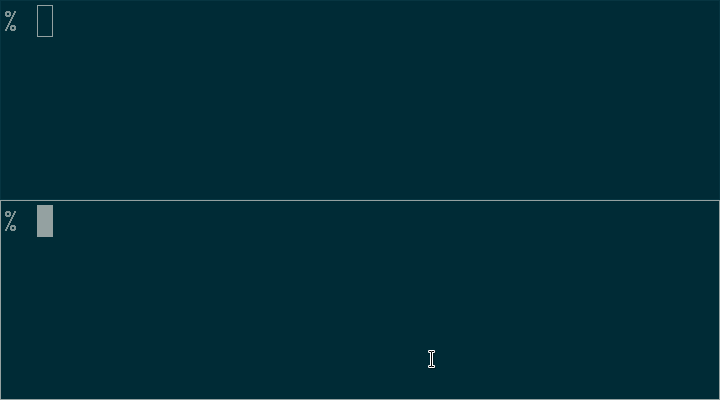

# psi-notify | [](https://travis-ci.com/cdown/psi-notify) [](https://lgtm.com/projects/g/cdown/psi-notify/alerts/?mode=list)

**tl;dr: psi-notify can alert you when resources on your machine are becoming
oversaturated, and allow you to take action *before* your system slows to a
crawl.**



psi-notify is a minimal unprivileged notifier for system-wide resource pressure
using [PSI](https://facebookmicrosites.github.io/psi/). This can help you to
identify misbehaving applications on your machine before they start to severely
impact system responsiveness, in a way which `MemAvailable`, CPU graphs, I/O
utilisation graphs and other metrics cannot.

## Features

- Runs unprivileged
- Minimal resource usage
- Works with any notifier using [Desktop
  Notifications](http://www.galago-project.org/specs/notification/0.9/index.html)

## Requirements

- Linux 4.20+ with `CONFIG_PSI` (enabled by default in most distributions)
- libnotify

## Installation

On Arch, the [psi-notify AUR
package](https://aur.archlinux.org/packages/psi-notify/) is available.

On Fedora and RHEL/CentOS 8, the [psi-notify
package](https://src.fedoraproject.org/rpms/psi-notify) is available, and will
shortly be pulled into Fedora/EPEL repositories.

Otherwise, manual installation is as simple as running `make` and putting the
resulting `psi-notify` binary in your PATH. You will need `libnotify`
installed.

After that, you just start psi-notify. A systemd user service is packaged and
can be used like so:

    systemctl --user start psi-notify

## Config

Put your configuration in `~/.config/psi-notify`. Here's an example that will
check roughly every 5 seconds⁺, and pop up a notification when the values are
exceeded:

```
update 5

threshold cpu some avg10 50.00
threshold memory some avg10 10.00
threshold io some avg10 10.00
```

The above is the default configuration if no config file exists. You may have
to tweak these depending on your hardware, machine behaviour, and normal
workloads.

You can reload the config without restarting by sending `SIGHUP` to psi-notify.

Look at the "config format" section below to find out more about what a valid
config looks like.

⁺ PSI has poll() support, but it's not currently available to unprivileged
users. See [this
discussion](https://lore.kernel.org/lkml/20200424153859.GA1481119@chrisdown.name).

## Comparison with oomd

[oomd](https://github.com/facebookincubator/oomd) and psi-notify are two
compatible and complementary projects -- they're not in opposition to each
other. oomd also uses PSI metrics, but it requires a policy about "what to
kill" in high-pressure scenarios. For example, on a web server we obviously
don't want to kill the web server if we can avoid that, so we should prioritise
other applications. On the desktop though, it's hard to say: should we kill
Chrome, or some IDE, or maybe something playing a movie? It's extremely
difficult (although perhaps possible) to produce a single configuration that
will do the right thing in even the majority of cases, so we opt to alert early
instead and have the user make the decision about what's high priority in their
user session. When integrating oomd for the desktop, most distributions will
likely end up having to make it less aggressive than would be ideal, so they
can still interoperate.

It's hard to produce a good policy for, say, one's working day, where at one
time my terminal is the most critical thing, at another my browser is, and at
another it's my mail client. At other times maybe I'm ok with the slowdown and
am willing to ride it out without killing anything. psi-notify sidesteps this
problem by simply notifying, rather than taking action.

## Config format

The update interval in seconds is specified with `update [int]`. The default is
`update 5` if unspecified.

Thresholds are specified with fields in the following format:

1. The word `threshold`.
2. The resource name, as shown in `cgroup.controllers`. `cpu`, `memory`, and
   `io` are currently supported.
3. Whether to use the `some` or `full` metric. See the definition
   [here](https://facebookmicrosites.github.io/psi/docs/overview#pressure-metric-definitions).
4. The PSI time period. `avg10`, `avg60`, and `avg300` are currently supported.
5. The threshold, as a real number between 0 and 100. Decimals are ok.

## Contributing

Issues and pull requests are welcome! Please feel free to file them [on
GitHub](https://github.com/cdown/psi-notify).

[sd_notify]: https://www.freedesktop.org/software/systemd/man/sd_notify.html
